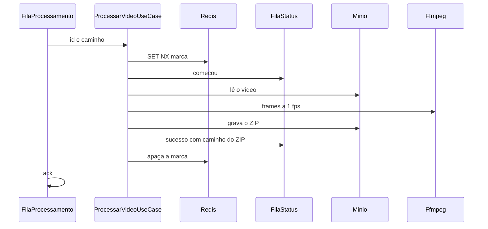

# ADR-011 — Contrato da fila de status, da marca e do ZIP

## Status

Aceita.

## Contexto

A Feature 3 consome a fila `processamento`, quebra o vídeo e devolve o resultado. A Video API ainda não aplica esse resultado no Postgres. Faltava fechar o corpo da fila `status`, a marca no Redis, o que acontece quando o trabalho falha e como o ZIP é gerado.

## Decisão

A fila durável se chama `status`. A mensagem é JSON em camelCase, no mesmo estilo da fila `processamento`.

- `comecou`: `id` e `momento`. Sem `caminho`. Sai antes da extração dos frames.
- `sucesso`: `id`, `momento` e `caminho`. Só sai depois do ZIP gravado no storage.
- `erro`: `id` e `momento`. Sem `caminho`.

No bucket `videos`, a chave do ZIP é `{id}/{id}.zip`. O caminho publicado é `videos/{id}/{id}.zip`.

O ffmpeg extrai um frame por segundo (`-vf fps=1`) em JPEG e esses arquivos entram no ZIP. Zero frames ou falha do ffmpeg é `erro`. O binário não entra na fila.

A marca no Redis é a chave `marca:{id}`, gravada com `SET NX`, sem prazo. Ela sai no sucesso, no erro e no desligamento do host. Se a chave já existe, a mensagem é confirmada e não há outro `comecou`, `sucesso` ou `erro`.

Erro de processamento confirma a mensagem. Ela não volta para `processamento`. Não há nova tentativa neste corte. O `nack` com requeue só acontece no cancelamento do host, e a marca sai antes disso.

Mensagem ilegível ou sem `id` é confirmada e descartada. Com `id` válido e caminho ou extração inválidos, o processor publica `erro`.

## Consequências

No console do MinIO aparece `{id}/{id}.zip`. No painel do RabbitMQ, a fila `processamento` esvazia e a fila `status` fica com `comecou` e depois `sucesso` ou `erro`. A Video API ainda não consome `status`, então o Postgres de vídeos permanece `aguardando_processamento`.

Uma queda no meio do trabalho pode deixar a marca. Na reentrega, o processor ignora esse vídeo. A marca só existe enquanto o trabalho dura.

O teste unitário usa storage, fila, Redis e ffmpeg de mentira. Não sobe MinIO, RabbitMQ, Redis nem o binário do ffmpeg.
