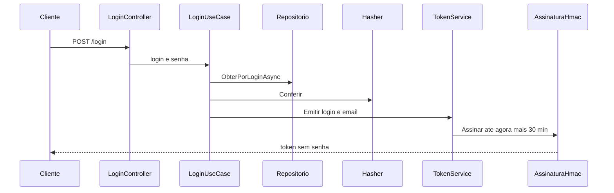

# Auth.Api

Host HTTP da Auth API. Projeto `src/Auth/Api`, alvo `net10.0`.

`POST /login` recebe login e senha e devolve o token. Não exige token na requisição. Senha errada e usuário inexistente respondem a mesma recusa. A senha não volta na resposta.

O cadastro exige o token da conta `Adm` no cabeçalho `Authorization: Bearer`:

- `POST /usuarios` cria e devolve o Guid
- `GET /usuarios` lista
- `GET /usuarios/{id}` consulta
- `PUT /usuarios/{id}` altera nome, e-mail e senha
- `DELETE /usuarios/{id}` remove

Sem token válido, ou com token de outro usuário, o cadastro não acontece.

## Exemplo

`GET /` responde 404. A conta `Adm` não é removida.

Este projeto referencia Application e Infra. As regras ficam no Domain. O PostgreSQL de usuários e a assinatura HMAC ficam na Infra. A chave local está em `appsettings.json`.

O corte está em [`planning/auth.md`](../../../planning/auth.md). A divisão em camadas está em [`docs/adrs/ADR-001-camadas-auth.md`](../../../docs/adrs/ADR-001-camadas-auth.md). O token está em [`docs/adrs/ADR-006-token-jwt-hmac.md`](../../../docs/adrs/ADR-006-token-jwt-hmac.md).

A imagem em `Dockerfile` publica este projeto. O CI gera a tag local `fase5-auth:ci` e não publica.
