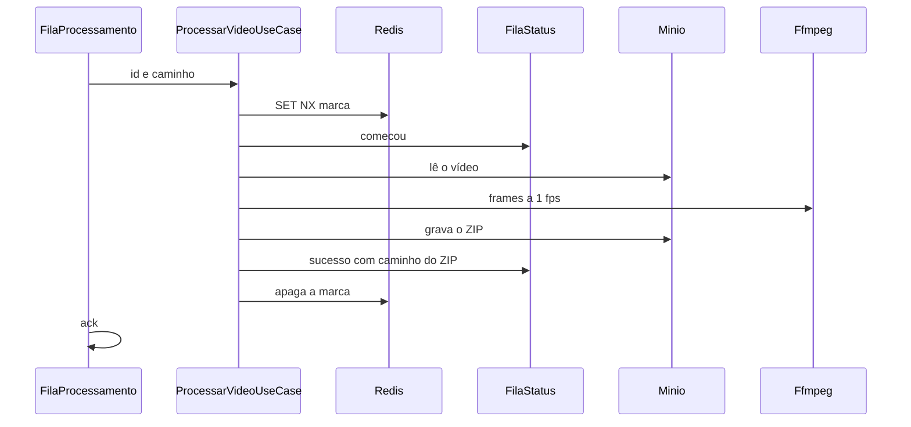

# Processor.Api

Host HTTP da Video Processor API. Projeto `src/Processor/Api`, alvo `net10.0`.

Não atende o usuário. Consome a fila `processamento`, marca o vídeo no Redis, grava o ZIP no MinIO e publica o resultado na fila `status`.

## Exemplo

`GET /` responde 404. `GET /metrics` responde o texto do Prometheus e não exige token.

Este projeto referencia Application e Infra. As regras ficam no Domain. Redis, MinIO, RabbitMQ e ffmpeg ficam na Infra.

Fora do Compose, em desenvolvimento, o storage é `http://localhost:9000`, a fila é `localhost:5672` e o Redis é `localhost:6379`. No Compose, os hosts públicos são `http://localhost:5300` e `http://localhost:5301`.

O passo a passo da prova local, com o ZIP no MinIO, a fila `status` e o Grafana, está em [`docs/monitoramento.md`](../../../docs/monitoramento.md).

O corte está em [`planning/planning.md`](../../../planning/planning.md). O contrato está em [`docs/adrs/ADR-011-contrato-fila-status.md`](../../../docs/adrs/ADR-011-contrato-fila-status.md). As métricas estão em [`docs/adrs/ADR-012-metricas-do-processor.md`](../../../docs/adrs/ADR-012-metricas-do-processor.md).

A imagem em `Dockerfile` publica este projeto e instala o ffmpeg. O CI gera a tag local `fase5-processor:ci` e não publica.
