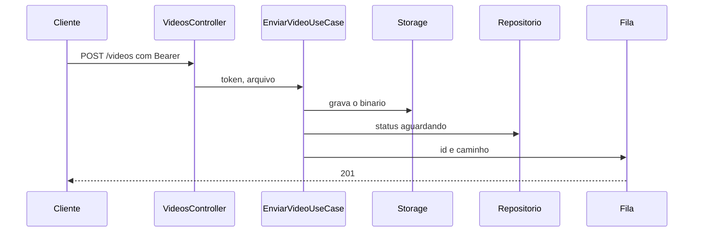

# Video.Api

Host HTTP da Video API. Projeto `src/Video/Api`, alvo `net10.0`.

`POST /videos` recebe o arquivo no campo `arquivo` e o token no cabeçalho `Authorization: Bearer`. Sem token válido, o vídeo não entra. Arquivo ausente ou vazio responde 400. O sucesso responde 201 com identificador, status `aguardando_processamento` e caminho.

O limite local do corpo é 200 MB.

## Exemplo

O host consome a fila `status` e grava `em_processamento`, `concluido` ou `erro` no Postgres. `GET /videos` exige o mesmo token e devolve a lista daquele login, lida do Redis. `GET /videos/{id}/download` exige o token e devolve o ZIP quando o status é `concluido`. Sem token válido, a resposta é 401. Vídeo de outro login, inexistente ou ainda não concluído responde 404. `GET /` responde 404. `GET /metrics` responde o texto do Prometheus, inclusive `fiapx_video_status`, `fiapx_video_listagem`, `fiapx_video_download` e `fiapx_video_email`, e não exige token. No `erro`, depois de gravar o status, a Video API envia um e-mail ao dono.

Este projeto referencia Application e Infra. As regras ficam no Domain. PostgreSQL, MinIO, RabbitMQ e Redis ficam na Infra. A chave local do token está em `appsettings.json` e é a mesma da Auth.

O corte está em [`planning/planning.md`](../../../planning/planning.md). O envio está em [`docs/adrs/ADR-009-contrato-upload-e-fila.md`](../../../docs/adrs/ADR-009-contrato-upload-e-fila.md). O status está em [`docs/adrs/ADR-013-aplica-status-no-registro.md`](../../../docs/adrs/ADR-013-aplica-status-no-registro.md). A listagem está em [`docs/adrs/ADR-014-listagem-no-redis.md`](../../../docs/adrs/ADR-014-listagem-no-redis.md). O download está em [`docs/adrs/ADR-015-download-do-zip.md`](../../../docs/adrs/ADR-015-download-do-zip.md). O e-mail está em [`docs/adrs/ADR-016-email-de-erro.md`](../../../docs/adrs/ADR-016-email-de-erro.md).

A imagem em `Dockerfile` publica este projeto. O CI gera a tag local `fase5-video:ci` e não publica.
