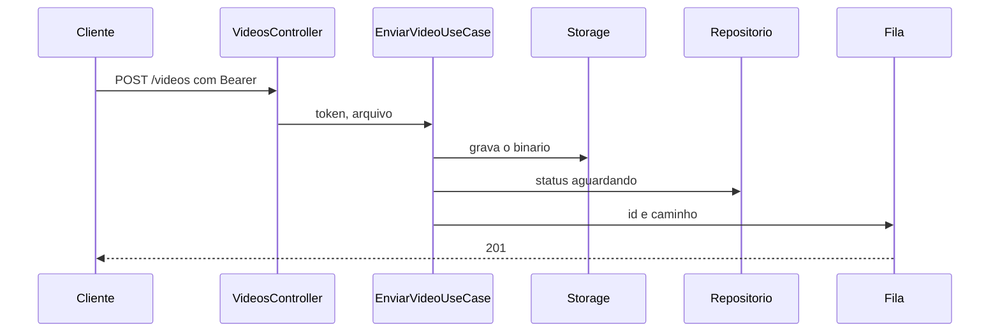

# Video.Api

Host HTTP da Video API. Projeto `src/Video/Api`, alvo `net10.0`.

`POST /videos` recebe o arquivo no campo `arquivo` e o token no cabeçalho `Authorization: Bearer`. Sem token válido, o vídeo não entra. Arquivo ausente ou vazio responde 400. O sucesso responde 201 com identificador, status `aguardando_processamento` e caminho.

O limite local do corpo é 200 MB.

## Exemplo

`GET /` responde 404.

Este projeto referencia Application e Infra. As regras ficam no Domain. PostgreSQL, MinIO e RabbitMQ ficam na Infra. A chave local do token está em `appsettings.json` e é a mesma da Auth.

O corte está em [`planning/planning.md`](../../../planning/planning.md). O contrato está em [`docs/adrs/ADR-009-contrato-upload-e-fila.md`](../../../docs/adrs/ADR-009-contrato-upload-e-fila.md).

A imagem em `Dockerfile` publica este projeto. O CI gera a tag local `fase5-video:ci` e não publica.
